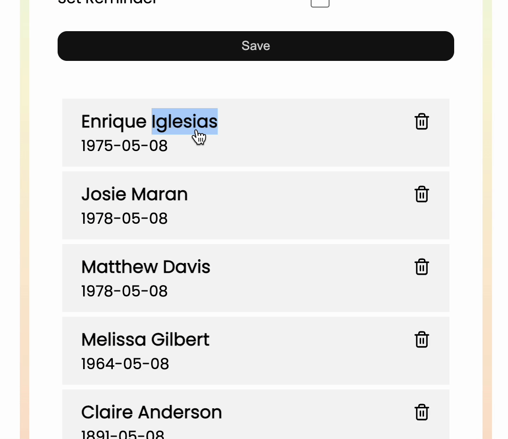

# Birthday Reminder

This app was built using create-react-app as a base. And it used CelebrityBucks API as the backend. 
 
## Installation

Install my-project with npm

```bash
  git clone https://github.com/weiwang98/birthday-reminder.git
  npm install birthday-reminder
  cd birthday-reminder
```
    
## Demo
#### Add Birthday
You can add the birthday of people you care about by typing their information. 

#### Celebrities' Birthdays
This app uses CelebrityBucks api as backend. You can get some celebrities' birthdays on the list by default. 

#### Toggle and Delete
Double click to toggle. Click the delete icon to delete item. 
